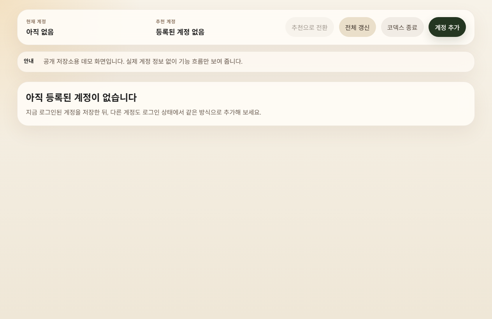
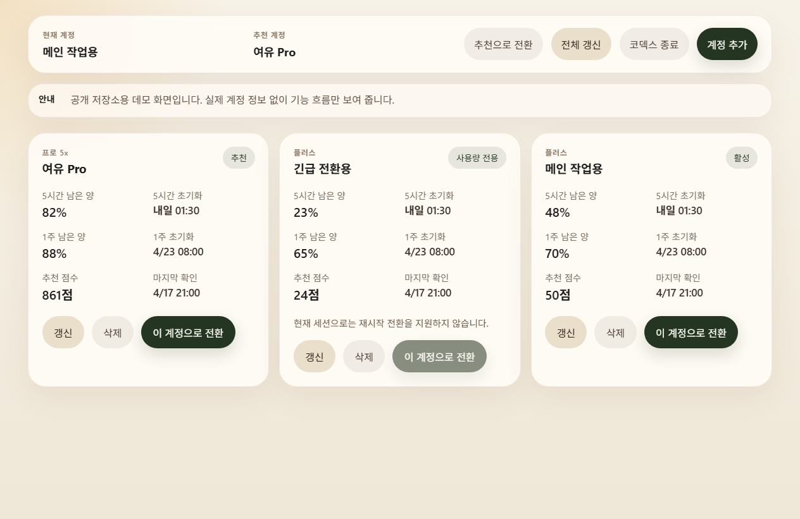
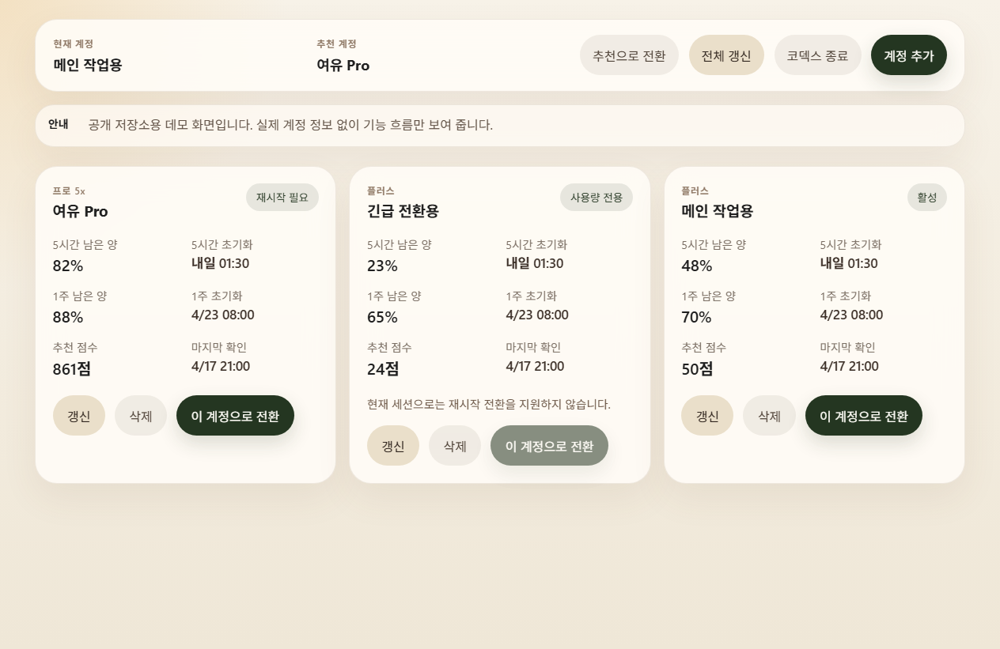

# OAuth Account Switcher

Codex를 다시 열기 전에, 여유 있는 계정으로 빠르게 바꾸는 Windows 데스크톱 앱입니다.

OAuth Account Switcher stores reusable Codex auth bundles, compares the remaining quota across multiple accounts, and helps you switch to the best account before restarting Codex.

## 왜 필요한가

여러 계정을 번갈아 쓰다 보면 사용량 한도에 막혔을 때 다시 로그인하고 세션을 복구하는 과정이 번거롭습니다. 이 앱은 현재 로그인된 Codex 인증 상태를 계정별로 저장해 두고, 남은 사용량을 비교한 뒤, 재시작 전에 가장 유리한 계정으로 전환할 수 있게 도와줍니다.

## 핵심 기능

- 현재 Codex 인증 상태를 계정 카드로 저장
- 5시간 / 1주 사용량 기준으로 추천 계정 계산
- 특정 계정 또는 추천 계정으로 전환 준비
- 계정별 사용량 새로고침 및 저장된 번들 삭제
- 재시작 전환이 필요한 계정을 명확한 배지로 표시

## 스크린샷

### 빈 상태



### 여러 계정이 등록된 상태



### 전환 적용 후 재시작 대기 상태



## 다운로드

가장 쉬운 설치 방법은 저장소의 `Releases` 탭에서 최신 버전을 내려받는 것입니다.

- `OAuth Account Switcher-<version>-x64.exe`: 설치형
- `OAuth Account Switcher-<version>-x64.zip`: 휴대용 압축본

처음 공개할 때는 Windows SmartScreen 경고가 보일 수 있습니다. 이 경우 `추가 정보 -> 실행`으로 진행하면 됩니다. 코드 서명과 자동 업데이트는 아직 포함되어 있지 않습니다.

## 빠른 시작

1. Codex에 원하는 계정으로 로그인합니다.
2. 앱에서 `계정 추가`를 눌러 현재 인증 상태를 저장합니다.
3. 다른 계정으로 로그인한 뒤 같은 방식으로 추가합니다.
4. 추천 계정 또는 원하는 계정으로 전환합니다.
5. Codex를 다시 열어 전환이 적용됐는지 확인합니다.

## 사용 방법

### 계정 추가

1. Codex에서 원하는 계정으로 로그인합니다.
2. 앱에서 `계정 추가`를 누릅니다.
3. 표시용 이름을 입력하고 저장합니다.

### 추천 계정으로 전환

- 상단의 `추천으로 전환` 버튼을 누르면 현재 가장 유리한 계정으로 전환 준비를 합니다.
- 이미 추천 계정이 활성 상태면 버튼은 비활성화됩니다.

### 특정 계정으로 전환

- 카드의 `이 계정으로 전환` 버튼을 누르면 앱이 `~/.codex/auth.json`을 교체합니다.
- 그 다음 Codex를 다시 열면 전환이 적용됩니다.

### 사용량 갱신과 삭제

- `전체 갱신`: 전체 계정 사용량 갱신
- `갱신`: 해당 계정만 갱신
- `삭제`: 목록과 저장된 번들 제거

## 데이터 저장 위치

앱은 기본적으로 아래 경로를 사용합니다.

- `~/.oauth-account-switcher/catalog.json`
- `~/.oauth-account-switcher/bundles/`
- `~/.oauth-account-switcher/backups/`
- `~/.oauth-account-switcher/app-state.json`

## 보안 / 한계

- 인증 번들은 로컬 디스크에 암호화 저장되지만, 완전한 계정 보안 솔루션은 아닙니다.
- CAPTCHA 우회, MFA 자동화, 비공식 UI 스크래핑 보장은 제공하지 않습니다.
- 다중 플랫폼 배포, 코드 서명, 자동 업데이트는 아직 제외되어 있습니다.

## 개발자 실행

```bash
npm install
npm run lint
npm test
npm run build
npm start
```

공개용 스크린샷은 아래 명령으로 다시 생성할 수 있습니다.

```bash
npm run screenshots:capture
```

Windows 배포물은 아래 명령으로 생성합니다.

```bash
npm run dist:win
```

## 릴리스

- 릴리스용 설명 템플릿: [docs/RELEASE_TEMPLATE.md](docs/RELEASE_TEMPLATE.md)
- GitHub 업로드 / 태그 / 공개 체크리스트: [docs/PUBLISHING.md](docs/PUBLISHING.md)
- 상세 사용 문서: [docs/USAGE.md](docs/USAGE.md)

## English Summary

OAuth Account Switcher is a Windows Electron app for people who use multiple Codex accounts. It stores reusable auth bundles locally, refreshes quota snapshots, recommends the best account to use next, and prepares the next Codex restart with the selected account.
